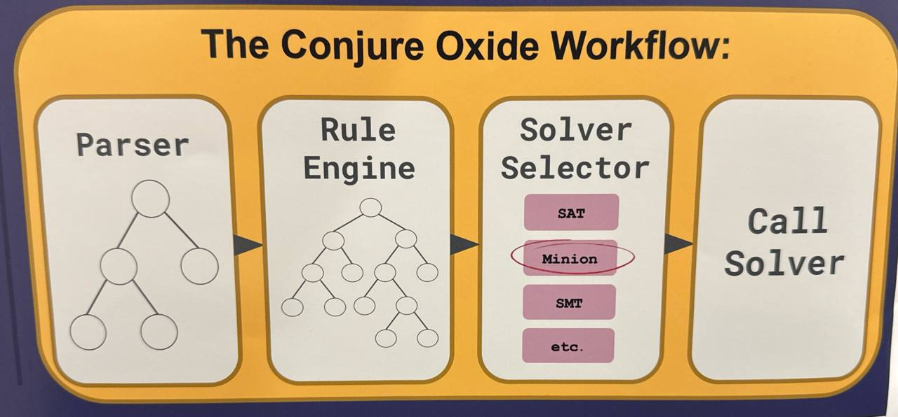

# Solver Adaptors

## What is an adaptor?

If you attended one of the VIP conferences and looked at our poster, you likely saw this architectural diagram:

In `conjure-oxide`, an **adaptor** is the component on the right (occasionally referred to as a "solver selector"). Its primary role is to bridge the gap between the high-level Essence model and a specific backend solver (such as CaDiCaL, Minion, or Z3).

### Workflow

The adaptor manages the following lifecycle:

1.  **Rule Injection:** It provides a specific set of transformation rules to the **Rule Engine**. These rules define how high-level constructs should be lowered (e.g., SAT-specific encodings for the SAT adaptor).
2.  **Reduction:** It triggers the rule engine to process the parsed `Model`. The engine iteratively applies the provided rules until the expression tree is reduced to a solver-ready state.
3.  **Solver Execution:** Once reduced, the adaptor feeds the resulting low-level constraints into the underlying solver and orchestrates the search for a solution.

By using different adaptors, `conjure-oxide` can target entirely different solving paradigms (CP, SAT, SMT) while sharing the same front-end parser and core rule-engine logic.
