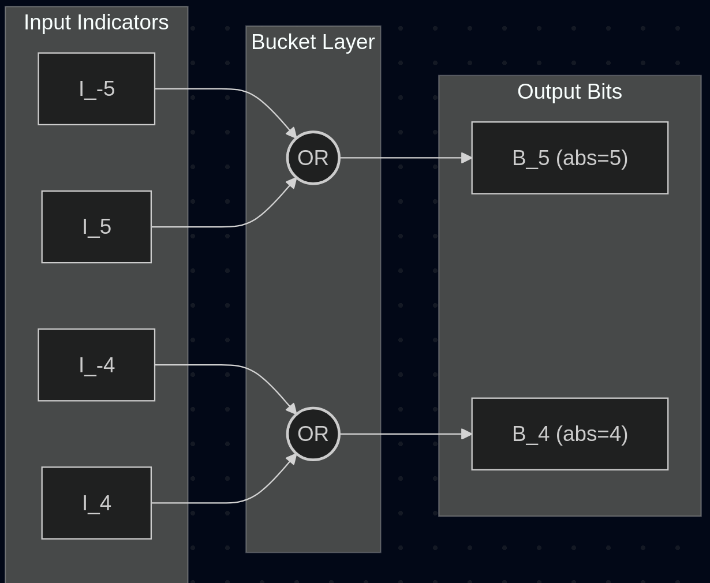

# Tricks for SAT

This page documents the clever implementation patterns and "tricks" used across different SAT rules in conjure-oxide. You might reuse them in other rules.

## Reusing Inequality Logic via Operand Swapping
Instead of implementing separate logic for `<`, `>`, `<=`, and `>=`, we can implement a single core rule (like, in direct-encoding we use `less-than` rule) and reuse it for all others by swapping operands or negating the final result.

*   **Logic:** 
    *   `A > B` becomes `B < A`
    *   `A <= B` becomes `NOT (B < A)`
    *   `A >= B` becomes `NOT (A < B)`

## The "Bucket" Method for Domains
Currently, in direct encoding, we use the **bucket method** for operations that map multiple input values to the same output (e.g., absolute value or squaring).

*   **Logic:** For each output value $k$ in the new domain, we identify all input values $v$ where $f(v) = k$. We then create an output bit $B_k$ by calculating the disjunction (OR) of all input indicator bits $I_v$ that fall into that "bucket". 

*   **Example:** For `abs(x)`, the output bit for value `5` is the result of `input_bit(-5) OR input_bit(5)`.

## Static Outcome Construction (Order-Encoded Division)
This thing is in an upcoming division rule PR for [order encoding](https://github.com/conjure-cp/conjure-oxide/pull/1775) is...

Instead of dynamically scanning for the boundary, the code uses adjacent bits to construct a negated condition for every exact pair $(i, j)$ and directly appends the statically computed outcome ($Q \ge m$ or $\neg(Q \ge m)$) to enforce the entire order-encoded quotient array simultaneously via De Morgan's clauses.

## Pairwise DNF-style Accumulation
For operations involving multiple operands like `sum(...)`, implementing a single massive circuit is difficult.

*   **Logic:** Accumulate the result pairwise. Start with the first operand as the "accumulator," then for each subsequent operand, perform a pairwise "addition" where every possible sum $k = i + j$ is represented as an OR of ANDs.

## Common-Range Normalisation (Zero/Sign Padding)
To simplify rule logic (especially zips and index lookups), we normalize all operands to a shared range before processing.

*   **Logic:** Calculate a global min/max across all operands. Pad Direct-encoded integers with `false` bits and Order-encoded integers with `true` (prefix) or `false` (postfix) bits to ensure all bit-vectors have the same length and align to the same values.
