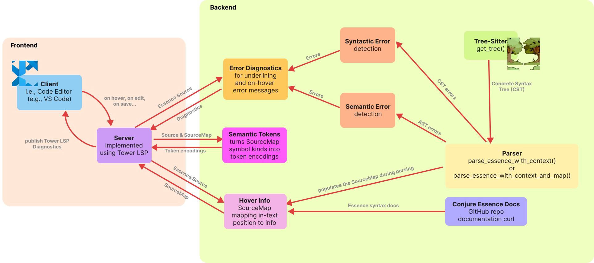

[//]: # (Author: Liz Dempster, Anastasia Martinson)
[//]: # (LAST Updated: 24/05/2026)

# LSP Documentation
## Overview
This is the overview documentation for the Language Server which is developed for use by Conjure Oxide. This is developed following the [Language Server Protocol](https://microsoft.github.io/language-server-protocol/) developed by Microsoft Visual Studio Code, and implemented following VSCode guidelines. This means that functionality cannot be guaranteed on other IDE, though this does not mean it will/cannot work. The Language Server and Client provide the basis through which a fully functional Essence extension will be produced. The server and client run as separate processes primarily because this minimises performance cost.

At present this addresses the client and server, with abstraction over lower level functions called by the server.

## Current Functionality Goals
Where implemented or actively in progress, the details of each goal shall be expanded upon. Achieving these goals would be considered a completed implementation.
- Syntax Highlighting (Achieved)
   - This is highlighting based on grammar structure.
- Semantic Highlighting (Achieved)
   - This is highlighting based on meaning rather than grammar.
- Error Underlining (Achieved)
   - Underlining errors of varying severity, providing informative messaging.
- Hover Tooltips (Achieved)
   - When hovering over a word, produces information relating to the hovered word.
- Code Autocomplete (Planned)
   - Produce completion options while user types.

## Files
```bash
# the server (excluding diagnostics)
crates/conjure-cp-lsp
└─ src/
   ├── lib.rs
   ├── server.rs
   └── handlers/
       ├── cache.rs
       ├── hovering.rs
       ├── mod.rs
       ├── semantic_highlighting.rs
       └── sync_event.rs
└─ Cargo.toml

# the client
tools/vscode-ext
├─ node_modules/ #contains installed node_modules
├─ out/          #contains files produced by npm compile
└─ src/
   └─ extension.ts
└─ syntaxes/
   └─ essence.tmLanguage.json
├─ language-configuration.json
├─ package.json
├─ package-lock.json
└─ tsconfig.json
```

## General Structure
The LSP architecture follows a client-server model where the client (editor extension) and server (language server) communicate asynchronously via JSON-RPC 2.0 protocol over standard I/O streams.

On `did_open` and `did_change`, the server parses and collects diagnostics (see [Diagnostics API](diagnostics-api.md)), converts them to `tower-lsp` diagnostics, and publishes them to the client. Hover and semantic-token requests use cached source-map data from the same parse pipeline.



## Client-Server Communication
The client and server communicate asynchronously through I/O streams. Communication occurs through requests and responses, which use well-defined JSON objects to communicate. This communication is triggered on events (such as on-open, on-save, on-change), where the client will prompt the server.

A client and server declare their capabilities during the initialisation handshake. These capabilities reflect what the server and client actually support, and so when new features are added these capabilities must be updated. Capabilities essentially allow for server and client to inform the other whether or not they support specific types of requests, ensuring that requests are not made needlessly. For example, `text_document_sync` indicates sync support (the server currently uses `INCREMENTAL` changes), `hover_provider` enables hover requests, and `semantic_tokens_provider` enables semantic-token requests.

## Client
The Client is a VSCode extension, in TypeScript. As such, the client represents the installed extension which is actively being used by a user. Broadly, we consider the client to be the VSCode IDE in any instance where a `.essence` file is open.

### Key Structure
The Client itself is programmed within a TypeScript file, called `extension.ts`. This simply launches the client, which then launches the server using `ServerOptions` to call `conjure-oxide server-lsp`.

Additionally, there is a `syntaxes/essence.tmLanguage.json` file, which lays out the syntactic grammar of Essence in a TextMate file. This file is what allows for Syntax Highlighting. The reason that this file exists, alongside the highlighting which will be performed by the server, is that this is extremely lightweight to implement. There are often performance costs associated with an LSP, as they can be large and require a lot of computation. As such, TextMate grammars allow for simple highlighting to occur before the LSP loads/while it is performing computation. `language-configuration.json` provides autoclosing of brackets, speech marks, etc.

The client also requires a number of `package[-lock].json` files. The functionality of these files is to declare to the VSCode IDE what the extension is called, where it is sourced within the codebase, and what it's functionality is. These files also establish the dependencies which are required for the client to function.

### Syntax Highlighting
As addressed above, syntax highlighting is implemented through a TextMate grammar. The basis of this grammar is that outlined by Conjure's VSCode extension[^bignote]
‌
## Server
The server is a Rust server, created using tower-lsp. This library was used as it abstracts over the low-level implementation details. The implementation also abstracts over the implementation of the Diagnostic API and the parser, both of which are implemented and manipulated further downstream (if we consider the client and server to be the frontmost end of the project). This allows for the server to implement new functionality freely, so long as the information is capable of being provided by the Diagnostic API. Essentially, the implementation of the Language Server here is a higher level construct which makes requests to other levels (e.g. Diagnostics) when required. This allows for the code of the server to be fairly simple and easy to follow.

### Key Structure
#### Backend
Backend is the custom struct which represents the state and functionality of the Language Server. In this, it **must** implement tower-lsp's LanguageServer trait. This struct is named Backend simply because it represents the basis of the Language Server, and because this is common naming convention.

The LanguageServer trait defined by tower-lsp is the interface through which our language server is capable of adhering to the Language Server Protocol. In this, the capabilities of our server, and the implementation of these capabilities on given events, are specified. The current capabilities include incremental document sync, hover, and semantic tokens.

As established above, during the initialise handshake, the capabilities of the server are laid out. In the current implementation, the server advertises `text_document_sync` (INCREMENTAL), `hover_provider`, and `semantic_tokens_provider`. It is worth noting that in the capabilities, the `text_document_sync` is set to `INCREMENTAL` to ensure that each trigger event causes the client to pass only the modified content of the file, and the range (except for the first call, where the file is passed in its entirety). This is not the default case.

There are currently eight core methods handled in the `LanguageServer` impl: `initialize`, `initialized`, `shutdown`, `did_open`, `did_save`, `did_change`, `hover`, and `semantic_tokens_full`. Sync handlers live in `handlers/sync_event.rs`; hover in `handlers/hovering.rs`; semantic highlighting in `handlers/semantic_highlighting.rs`.

#### Cache
This LSP uses a library called [Moka](https://github.com/moka-rs/moka) in order to implement caching. The reason that caching has been added is to reduce the time required to load longer files, especially if they are being reused, as this means that they can simply be recovered from the cache. The cache is also used alongside the incremental updates. Modifying the cache occurs within `sync_event`, but the cache is defined and instantiated in `handlers/cache.rs`. The cache itself is made up of a series of `CacheCont`s, which store a given files sourcemap, AST, CST, errors, contents, and versioned index. The cache has `max_capacity(10_000)`, a time to live of 30 minutes, and a time to idle of 5 minutes. The cache uses the uri (uniform resource identifier) of a file as its key, as this is unique to a file. This means that if a file changes location in the file tree (and therefore its URI changes), it will have to be re-entered into the cache, and the previous copy will time out of TTL/TTI and will be evicted.

#### sync_event
These are split from the main `server.rs` primarily for readability, and to prevent the main body of the server from becoming bloated. Rust allows a struct to have it's `impl` split over multiple files, so this file also simply implements functionality to the Backend struct.

**handle_did_open**
This is the handler for the did_open event. On open, the cache is queried by the uri of the opened file to see whether it currently exists in the cache. If not, the file is used to generate the CST, AST, sourcemap, etc., which populate the CacheConts. Diagnostics are then published from cached parser errors to produce the error underlining.

**handle_did_save**
`did_save` currently only logs the save event. Diagnostics are intentionally driven by `did_change` to avoid races with in-flight parse updates.

**handle_did_change**
When changing a file, the `INCREMENTAL` sync setting provides range-based edits. The handler applies edits to cached text, updates the CST incrementally via tree-sitter `InputEdit`, updates/invalidates affected source-map spans, then stores provisional cache state immediately. Parsing and diagnostics publication are then run in a short debounced background task with version checks to drop stale updates.

Diagnostics are published by mapping cached `RecoverableParseError`s through `error_to_diagnostic`, converting parser diagnostics to `tower-lsp` diagnostics via `convert_diagnostics`, and calling `publish_diagnostics` on the client. Publishing a new set replaces the previous diagnostics for that document.

#### convert_diagnostics, parser_to_lsp_range, parser_to_lsp_position
These are helper functions which allow for the transformation of a vector of `parseDiagnostics` to `lspDiagnostics`. This is done through iterating through the vector, and setting values according to `parseDiagnostics`. This is because the JSON communication between the Server and it's Diagnostic API is not defined the same as the communication between the Server and the Client, though all of the correct information is communicated.

#### position_to_byte, position_to_treesitter_point, calculate_new_end_position
These are helper functions to allow for the functionality of INCREMENTAL synchronising. `position_to_byte` converts from an LSP Position into a byte index, to allow for `replace_range` to function, and `calculate_new_end_position` is used to calculate the new end of the range. `position_to_treesitter_point` operates to allow for the incremental editing to function.

#### Main
Main is responsible for launching the server using the tokio library, as this is the async library tower-lsp is designed to be used with. This is the function which is called from outwith the `conjure-cp-lsp` crate. For example, main is called to run the server, from conjure-oxide's subcommand `server-lsp`. This also instantiates the cache, using `create_cache`.

### Error Underlining
The core functionality of this is expanded upon within the [Diagnostics API documentation](diagnostics-api.md). Most implementation details of Error Underlining are covered above. Error underlining is done through publishing diagnostics, which contain a range, warning level, and associated error text. The client receives these diagnostics, and then displays the underlining as directed. The IDE will contain the error message on hover. Error underlining is demonstrated in [Error Underlining Video](ErrorUnderlineExample.mp4).

#### Hovering

Hovering is implemented by `handle_hovering`. The contents of the file are gathered from the cache using the uri, and then the sourcemap (from cache) is gathered. The LSP Position is converted into a byte, and then the helper method `hover_info_at_byte` is used to gather the information from the sourcemap for this byte. This is then posted to the client, allowing for the information to be seen on hover.

Hover relies on source-map availability in the cache. If parsing fails fatally and no source map is cached, hover returns no result.

## Development
### How to use (for development)
At the current stage of development, the extension is not released into the VSCode Marketplace. This means that functionality must be tested using VSCode's Extension Development Environment. In order to ensure that this works as intended, compile `extension.ts` using `npm run compile` (or ctrl-shift-b and select this). Then launch the Extension Development Environment. This can be launched **either** by pressing F5 from within `extension.ts`, or by pressing on 'Run' within the 'Run and Debug' VSCode tab. Running the Extension Development Environment will cause the client to run. Due to the structure of the client-server, the server will then run and link to the client, and the LSP can then be tested. Please ensure that `npm install` has been run in advance/all required node modules are installed, otherwise the client will not be able to launch. The client can be seen running when opening a .essence file. In the VSCode panel (bar at bottom)'s output, it is possible to select Conjure-Oxide Language Server as the channel to listen to. This will display the logs communicated to the client.

It is worth noting that a copy of conjure-oxide **MUST** be installed in order for the client to work. Testing the server requires for an updated install.

If wishing to just run the server (though without a client it will be incapable of connecting to anything, and will time out), the user can run `conjure-oxide server-lsp`, which is a custom subcommand specifically to call the server. This does not run any other aspects of conjure-oxide.

### Development Directions
When developing, ensure that whatever functionality is being added has it's respective capability communicated to the client during the initialisation handshake, otherwise the triggering events will not be communicated by the client.

Furthermore, it is of note that the server and client communicate over standard input and output. As such, nothing which will be called by the server, including the server itself, should ever write onto or read from the stdin and stdout streams. This should always be handled by the tower-lsp library, to ensure that the communication occurring is JSONrpc as expected by the client. Any incorrectly formed writing to the stream will cause the client to close the server and disconnect.

## References
[^bignote]:
   conjure-cp (2025). conjure-vs-code/syntaxes/essence.tmLanguage.json at main · conjure-cp/conjure-vs-code. [online] GitHub. Available at: https://github.com/conjure-cp/conjure-vs-code/blob/main/syntaxes/essence.tmLanguage.json
