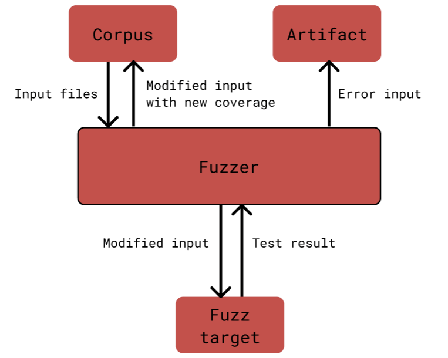

[//]: # (Author: Yi Xin Chong)
[//]: # (Last Updated: 24/5/2026)

# Fuzz testing

## Overview
Fuzz testing is an automated test generation suite that generates new Essence input based on a given set of Essence input files (see [How it works](#how-it-works)), using the built in [`cargo-fuzz` library](https://rust-fuzz.github.io/book/cargo-fuzz.html) of Rust that invokes `libFuzzer`. The goal of fuzz testing is to improve robustness and safety of functions to ensure that edge cases and crash inducing inputs are discovered.

## Structure
```bash
fuzz/
├─ artifacts/                   # stores all crash reports from tests
├─ corpus/                      # stores the input files for testing
└─ targets/                     # target functions to be fuzz tested
  └─ fuzz_detect_errors.rs
```

## How it works
The fuzzer takes the seed files copied to the `corpus/` directory and manipulates them by inserting, erasing, or shuffling the bytes of the Essence files, then use them as inputs for the fuzz targets containing the functions to be tested in the `fuzz_targets/` directory. If the modified input caused a panic from the fuzz target, the input will be stored into `/artifact`, which can be minimised to the smallest reproducer using the `tmin` command in cargo fuzz. If the modified input contains new coverage, it will be stored back into the internal corpus to be used in future tests.



## Usage

1. Create directory for test corpus file 
```bash 
mkdir fuzz/corpus/{test_name}
```
2. Copy Essence files from codebase to corpus before running fuzz tester 
```bash
find . -name "*.essence" -type f -exec cp {} fuzz/corpus/{test_name}/ \;
```
Or you can create your own Essence seed files.

3. Run `cargo fuzz run {testname}`, for example: 
```bash
cargo fuzz run detect_errors -- -max_len=4096 -max_total_time=3600
```

NOTE: The fuzzer will run indefinitely without flags unless: 
- a crash was reported
- stopped manually using Ctrl + C
 
To make the fuzzer stop manually, use the following limits:
- Total iterations: `-runs=N`
- Time (seconds): `-max_total_time=N`
- Maximum input length: `-max_len=N`

The error test cases can be minimised using `tmin` to find the source of the error. The corpus can also be minimised using `cmin` to retain only the minimal files that cover all code paths. Example:

```bash 
cargo fuzz tmin {test_name} fuzz/artifacts/{test_name}/crash-{crashID}
```

See the [`cargo-fuzz` library](https://rust-fuzz.github.io/book/cargo-fuzz.html) for more information.

## How to add tests
To add a new test, create a new file in the `/fuzz_targets` directory and create a fuzz target function in the file (see `fuzz_detect_errors.rs` for reference). Add a new `[[bin]]` in `Cargo.toml` and add the test name and path for the fuzz target so that it can be called using `cargo fuzz run`.

## Future improvements
The current fuzzer is not grammar aware, hence it could be extended to use `tree-sitter` grammar to generate Essence based input files to test for correctness.