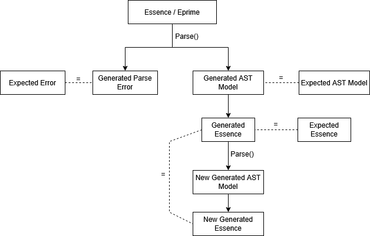

[//]: # (Authors: Nicholas Davidson, Soph Morgulchik)
[//]: # (Last Updated: 24/05/2026)

# Roundtrip Testing
## Overview

Roundtrip tests check that parsing is valid and that there is no unexpected behaviour during a full roundtrip of an Essence file.
Roundtrip tests do not consider rewriting or solving.

## Full Test Structure
The structure of a roundtrip test is shown in the following diagram:

The first phase tests that the parser is still performing as expected. As with the other tests in the suite, if the expected should have changed the suite can be run with `ACCEPT=true` to overwrite these expected files with whatever is generated.
- The test parses a provided Essence or Essence' file.
- If this parse is valid, it saves the generated AST model JSON and generated Essence representation and compare these to the expected versions.
- Otherwise, if fails; it saves the generated error outputs and compares this to the expected version.

The second phase tests that the structure of the input does not change during parsing without applying any rules to it, ensuring validity.

- If the initial parse was successful the roundtrip phase of the test occurs. 
- The newly generated Essence is then parsed back into Conjure-Oxide and used to generate a new AST and output Essence file
- This new Essence file is then compared with the previously generated one and asserted equal.

## Multiple Parsers
Roundtrip tests support both the legacy and tree-sitter parsers.

The parser used for a test can be specified in a `config.toml` in the test directory using the form `parsers = [<string list of parsers>]`, where `"via-conjure"` refers to the legacy parser and `"tree-sitter"` refers to the tree-sitter parser.

If no parser is specified, both parsers will be used by default. Each parser uses separate generated and expected files, as the output may differ between parsers.

## Testing Parser Errors
Error output tests are located in `./tests-integration/tests/roundtrip/invalid`, split into semantic and syntactic subdirectories.

Test directories may contain a `notes.txt` file documenting known differences between the error outputs of the legacy and tree-sitter parsers, or noting missing error detection functionality. Essence files that currently produce incorrect error outputs for both parsers are labelled `input.disabled`.

## Param Files 
Roundtrip tests treat `.param` files as an optional “instantiate” step that runs after the main model parses. For each test directory, the program looks for a .param file and, if present, parses it with the same parser + shared `Context` as the `.essence` input. If both parses succeed, it instantiates the problem model with the param model with [`instantiate_model`](https://github.com/conjure-cp/conjure-oxide/blob/main/crates/conjure-cp-core/src/instantiate.rs). 
If anything fails (problem parse, param parse, or instantiation), the test records an error and follows the error output path. 

## Creating a New Roundtrip Test
To create a new roundtrip test you must create a new directory under `./tests-integration/tests/roundtrip/`.
Any directories within here than contain a singular `.essence` or `.eprime` file will be treated as a test.
After creating the Essence or Essence' file for your test you should run the test suite with `ACCEPT=true` to generate the expected files.
