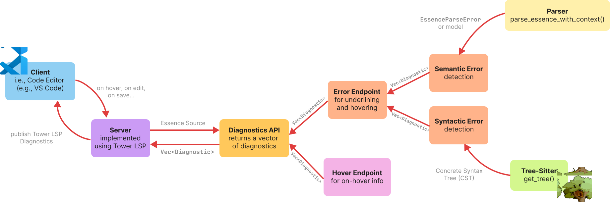

[//]: # (Author: Anastasia Martinson)
[//]: # (Last Updated: 18/12/2025)

# Overview
The Language Server Protocol (LSP) for Essence is designed to provide error detection and syntax highlighting for the Essence language. It consists of a server component and a diagnostics API. When fully implemented, the server will receive document change events from clients (e.g., VS Code), call the diagnostics API to detect syntactic and semantic errors, and publish these diagnostics back to the client for. The diagnostics API provides error detection and document symbol information for syntax highlighting. Its main purpose is to improve the user experience when formulating the problems in Essence.

# Structure
The LSP architecture follows a client-server model where the client (editor extension) and server (language server) communicate asynchronously via JSON-RPC 2.0 protocol. The server runs as a separate process, and exchanges messages over standard I/O streams. More on that in [LSP structure docs](lsp-server-client.md).

When the client requests diagnostics (on open, one edit, on hover... etc.), the LSP forwards this request to the Diagnostics API (for more details see [Diagnostics API](./diagnostics_api.md)), which responds with a list of diagnostics which the server converts to `tower-lsp`-compatible types and publishes to the client.

