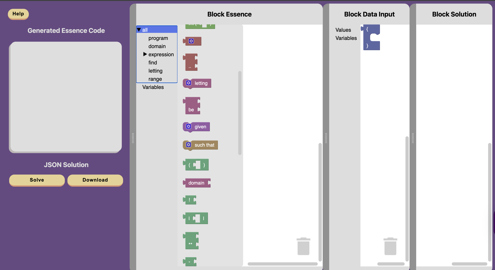

<!--
author: Nadine Martin
last updated: 21-12-2025
-->
# Conjure Blocks

Conjure blocks is an online block editor for Essence. This tool allows you to write constraint programs in blocks, which are then translated into Essence. [Conjure-aaS](https://conjure-aas.cs.st-andrews.ac.uk/) is used to solve these problems. Conjure blocks is an ongoing project.

See the the [Conjure Blocks repository](https://github.com/conjure-cp/conjure-blocks), the [Conjure Blocks Documentation](https://conjure-cp.github.io/conjure-blocks/docs/) and the [live site](https://conjure-cp.github.io/conjure-blocks/) for more information.
